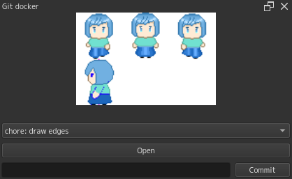

# Krita-git-docker
A Krita plugin for viewing Krita files in other git revisions.

## Screenshot

## Installation

Clone this project and copy `gitdocker.desktop`, `gitdocker/__init__.py`, and `gitdocker/gitdocker.py` to the `pykrita` directory in your Krita resource folder. See [the documentation](https://docs.krita.org/en/reference_manual/resource_management.html#resource-management) for the location of the Krita resource folder.

## License

All files are licensed under GNU General Public License v3.0. See [LICENSE](https://github.com/toku-sa-n/Krita-git-docker/blob/main/LICENSE).
